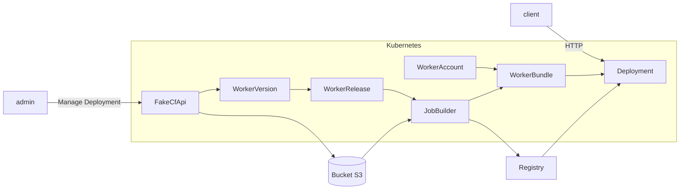

# The architecture


## Install it

### Install the Arch

The entire projects runs on Kubernetes, so need to install all the project before using it.

First, clone this GitHub Repository: `git clone https://github.com/clementreiffers/CfKubernetesArch.git`

Then run the following commands: `cd CfKubernetesArch && make deploy`

it will create all you need to use this architecture.

### Install the FakeCfApi

This API is needed if you want to use the [Wrangler CLI](https://developers.cloudflare.com/workers/wrangler/) in this 
Architecture.

run : `kubectl apply -f https://raw.githubusercontent.com/clementreiffers/fake-cf-api/main/kubernetes/fake-cf-api.yaml`

## Use it

once installed, create your first account on Octo Worker.

run : `kubectl apply -f https://raw.githubusercontent.com/clementreiffers/CfKubernetesArch/main/config/samples/api_v1_workeraccount.yaml`

It will apply this resource : 

```Yaml
apiVersion: api.cf-worker/v1
kind: WorkerAccount
metadata:
  labels:
    app.kubernetes.io/name: workeraccount
    app.kubernetes.io/instance: workeraccount-sample
    app.kubernetes.io/part-of: workerbundle
    app.kubernetes.io/managed-by: kustomize
    app.kubernetes.io/created-by: workerbundle
  name: "398803b74bcdb1b454434669bc634190" # account
spec:
  workerBundleName: worker-bundle-name
  workerReleaseSelector:
    matchLabels:
      accounts: "1234"
  podTemplate:
    imagePullSecret: "insert-secret-here"
```

you can change the `workerBundleName` and the WorkerAccount's name as you want!

## How it works

The entire architecture works with Kubernetes Operators.
They will operate following this graph:


