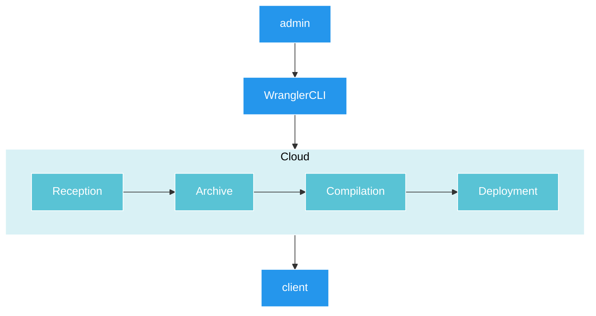
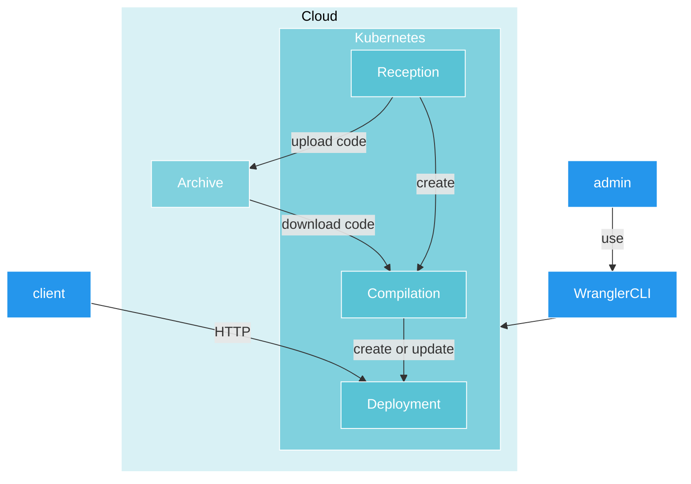
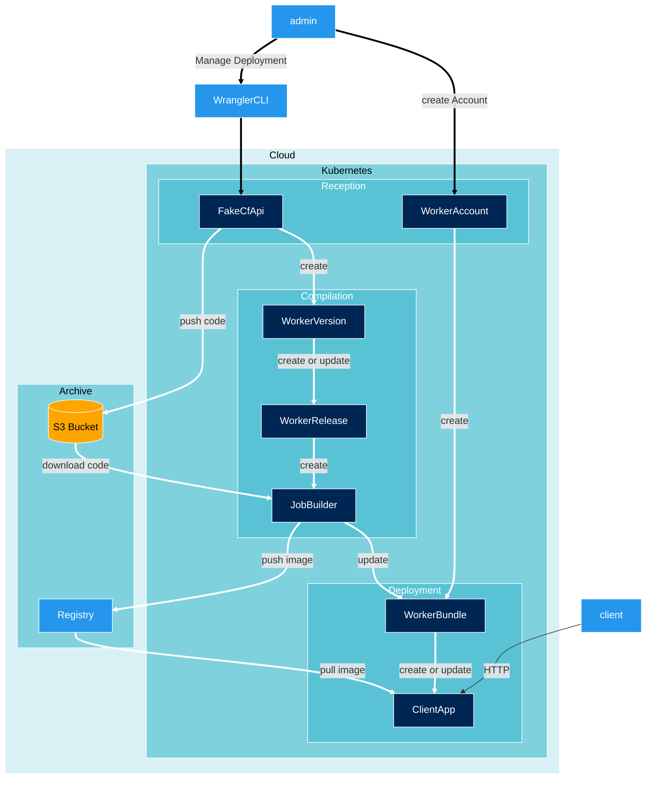

# Architecture

This step will explain how to set up the entire architecture, including the necessary [secrets](#setup-secrets), 
all [Kubernetes Operators](#setup-the-architecture), and the [fake-cf-api](#install-fakecfapi).

## Installation

### Setup secrets

The architecture requires access to both an Image Registry and an S3 Bucket, so let's configure them!

#### Image Registry Secrets

:::info
This architecture currently exclusively supports Docker Hub as the Image registry.
:::

create a file named `config-docker-hub.json` and write inside of it :
```json
{
  "auths": {
    "https://index.docker.io/v1/": {
        "username":"YOUR_USERNAME",
        "password":"YOUR_PASSWORD"
      }
  }
}
```

Then you can execute this command:
```
cat config-docker-hub.json | base64
```

The following command line will create an encoded string that contains all credentials for Docker Hub accounts. Please 
copy and paste this encoded string into a new document named `docker-hub-secret.yaml`:

```yaml
apiVersion: v1
data:
  .dockerconfigjson: ENCODED_STRING_HERE
kind: Secret
metadata:
  creationTimestamp: null
  name: docker-hub
type: kubernetes.io/dockerconfigjson
```

and now you can apply this resource by running `kubectl apply -f docker-hub-secret.yaml`

#### S3 Secret

:::info
The testing of an S3 Bucket was exclusively performed on Scaleway.
:::

You need to create a S3 on the Cloud provider of your choice, and follow all steps below.
All steps shows how yo do setup AWS config using scaleway for example.

Once created, you can follow [this tuto](https://www.scaleway.com/en/docs/storage/object/api-cli/object-storage-aws-cli/) 
to login to Scaleway S3 using the `aws-cli`

##### Credentials

To create a secret `s3-credentials`, run this command: 
```
kubectl create secret generic --from-file=~/.aws/credentials s3-credentials
```

##### Config

create a file named `configmap-aws.yaml` and write inside:
```yaml
apiVersion: v1
kind: ConfigMap
metadata:
  name: aws-config
data:
  config: |
    [default]
    region = fr-par
    s3 =
      endpoint_url = https://s3.fr-par.scw.cloud
      signature_version = s3v4
      max_concurrent_requests = 100
      max_queue_size = 1000
      multipart_threshold = 50 MB
      multipart_chunksize = 10 MB
    s3api =
      endpoint_url = https://s3.fr-par.scw.cloud
```

take care to configure the aws-config correctly following [this tuto](https://www.scaleway.com/en/docs/storage/object/api-cli/object-storage-aws-cli/).

and now you can apply it by running: `kubectl apply -f configmap-aws.yaml`

### Setup the Architecture

The entire project runs on Kubernetes, so you need to install all the necessary components before using it.

First, clone this GitHub repository: `git clone https://github.com/clementreiffers/CfKubernetesArch.git`

Next, execute the following commands: `cd CfKubernetesArch && make deploy`

This will create all the required resources for using this architecture.

### Install FakeCfApi

The FakeCfApi is essential if you want to use the Wrangler CLI within this architecture.

Run: `kubectl apply -f https://raw.githubusercontent.com/clementreiffers/fake-cf-api/main/kubernetes/fake-cf-api.yaml`

## Usage

You need to Login before create your very first Octo Worker, to do so, go to [the Wrangler CLI login](#/docs/tools-needed#wrangler-cli) 
and come back here.

you need a file that you can curl here : `curl -O -L https://raw.githubusercontent.com/clementreiffers/cf-workers-kubernetes-arch/main/config/samples/api_v1_workeraccount.yaml`

Once downloaded, modify it to set the account ID you got when you were logging to 
[cloudflare using wrangler CLI](#/docs/tools-needed#wrangler-cli).

you can now run: `kubectl apply -f api_v1_workeraccount.yaml` and that's all!

:::tip
you can change the `workerBundleName` and the WorkerAccount's `name` as you want!
:::

## How it works

The entire architecture works with Kubernetes Operators.
They will operate following these graphs belows:

### What do we need

This graph defines our requirements as follows:

1. It is crucial to use the same tools as Cloudflare for a fully manageable architecture, achieved through the use of the 
WranglerCLI.
2. The entire deployment process must be fully automated in the cloud. Therefore, we require the implementation of CI/CD
to manage code deployment, leading to the creation of a deployment at the end.
3. We seek a comprehensive architecture that is compatible with CDN.



### Simplified Architecture

To meet our requirements, we employ a Kubernetes Cluster with our custom Kubernetes Operators. These Kubernetes 
Operators handle the entire CI/CD process for deploying customer code.
Some versions, such as KubeEdge, are compatible with CDN, making them a suitable solution that aligns with our needs.



### Complete Architecture

This comprehensive architecture encompasses various Kubernetes Operators, each of which is described below:

#### WorkerAccount

The WorkerAccount serves as the initial resource that an administrator must create. It provides a reference to identify 
the corresponding Deployment linked to this account.

#### FakeCfApi

The FakeCfApi receives codes sent by an admin and pushes them into an S3 Bucket. Subsequently, it creates a CRD 
(Custom Resource Definition) called WorkerVersion, containing the project name and the S3 link.

#### WorkerVersion

The WorkerVersion consolidates the project name from the admin and stores the link to the S3 Bucket where the code is 
retained. Its design facilitates future updates and allows for rollbacks, if necessary.

#### WorkerRelease

The WorkerRelease aggregates multiple WorkerVersions. Once it is created or updated, it triggers a JobBuilder to prepare
a new deployment.

#### JobBuilder

The JobBuilder is created by the WorkerRelease. Once initiated, it generates a job utilizing Kaniko to construct a new 
container for the subsequent deployment. After completion, it updates a WorkerBundle.

#### WorkerBundle

The WorkerBundle facilitates the complete deployment (including Deployment, Ingress, Service, HPA) of the project when 
updated by the JobBuilder. It is initially created by the WorkerAccount.



