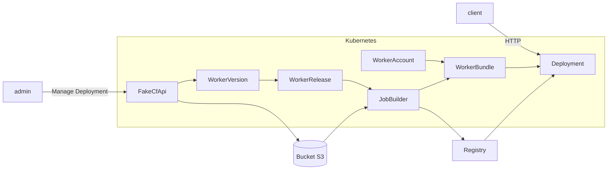

# Architecture

## Installation

### Setup the Architecture

The entire project runs on Kubernetes, so you need to install all the necessary components before using it.

To begin, clone this GitHub repository: `git clone https://github.com/clementreiffers/CfKubernetesArch.git`

Next, execute the following commands: `cd CfKubernetesArch && make deploy`

This will create all the required resources for using this architecture.

### Install FakeCfApi

The FakeCfApi is essential if you want to use the Wrangler CLI within this architecture.

Run: `kubectl apply -f https://raw.githubusercontent.com/clementreiffers/fake-cf-api/main/kubernetes/fake-cf-api.yaml`

## Usage

Once installed, you can create your first account on Octo Worker.

Run: `kubectl apply -f https://raw.githubusercontent.com/clementreiffers/CfKubernetesArch/main/config/samples/api_v1_workeraccount.yaml`

It will apply this following resource :

```Yaml
apiVersion: api.cf-worker/v1
kind: WorkerAccount
metadata:
  labels:
    app.kubernetes.io/name: workeraccount
    app.kubernetes.io/instance: workeraccount-sample
    app.kubernetes.io/part-of: workerbundle
    app.kubernetes.io/managed-by: kustomize
    app.kubernetes.io/created-by: workerbundle
  name: "398803b74bcdb1b454434669bc634190" # account
spec:
  workerBundleName: worker-bundle-name
  workerReleaseSelector:
    matchLabels:
      accounts: "1234"
  podTemplate:
    imagePullSecret: "insert-secret-here"
```

you can change the `workerBundleName` and the WorkerAccount's name as you want!

## How it works

The entire architecture works with Kubernetes Operators.
They will operate following this graph:


