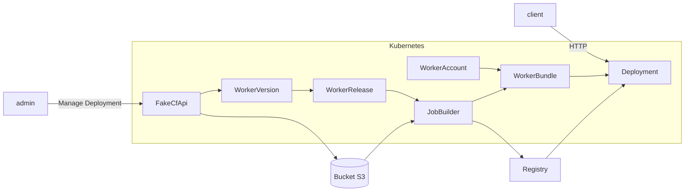

# Architecture

This step will explain how to set up the entire architecture, including the necessary [secrets](#setup-secrets), 
all [Kubernetes Operators](#setup-the-architecture), and the [fake-cf-api](#install-fakecfapi).

## Installation

### Setup secrets

The architecture requires access to both an Image Registry and an S3 Bucket, so let's configure them!

#### Image Registry Secrets

:::info
This architecture currently exclusively supports Docker Hub as the Image registry.
:::

create a file named `config-docker-hub.json` and write inside of it :
```json
{
  "auths": {
    "https://index.docker.io/v1/": {
        "username":"YOUR_USERNAME",
        "password":"YOUR_PASSWORD"
      }
  }
}
```

Then you can execute this command:
```
cat config-docker-hub.json | base64
```

The following command line will create an encoded string that contains all credentials for Docker Hub accounts. Please 
copy and paste this encoded string into a new document named `docker-hub-secret.yaml`:

```yaml
apiVersion: v1
data:
  .dockerconfigjson: ENCODED_STRING_HERE
kind: Secret
metadata:
  creationTimestamp: null
  name: docker-hub
type: kubernetes.io/dockerconfigjson
```

and now you can apply this resource by running `kubectl apply -f docker-hub-secret.yaml`

#### S3 Secret

:::info
The testing of an S3 Bucket was exclusively performed on Scaleway.
:::

You need to create a S3 on the Cloud provider of your choice, and follow all steps below.
All steps shows how yo do setup AWS config using scaleway for example.

Once created, you can follow [this tuto](https://www.scaleway.com/en/docs/storage/object/api-cli/object-storage-aws-cli/) 
to login to Scaleway S3 using the `aws-cli`

##### Credentials

To create a secret `s3-credentials`, run this command: 
```
kubectl create secret generic --from-file=~/.aws/credentials s3-credentials
```

##### Config

create a file named `configmap-aws.yaml` and write inside:
```yaml
apiVersion: v1
kind: ConfigMap
metadata:
  name: aws-config
data:
  config: |
    [default]
    region = fr-par
    s3 =
      endpoint_url = https://s3.fr-par.scw.cloud
      signature_version = s3v4
      max_concurrent_requests = 100
      max_queue_size = 1000
      multipart_threshold = 50 MB
      multipart_chunksize = 10 MB
    s3api =
      endpoint_url = https://s3.fr-par.scw.cloud
```

take care to configure the aws-config correctly following [this tuto](https://www.scaleway.com/en/docs/storage/object/api-cli/object-storage-aws-cli/).

and now you can apply it by running: `kubectl apply -f configmap-aws.yaml`

### Setup the Architecture

The entire project runs on Kubernetes, so you need to install all the necessary components before using it.

First, clone this GitHub repository: `git clone https://github.com/clementreiffers/CfKubernetesArch.git`

Next, execute the following commands: `cd CfKubernetesArch && make deploy`

This will create all the required resources for using this architecture.

### Install FakeCfApi

The FakeCfApi is essential if you want to use the Wrangler CLI within this architecture.

Run: `kubectl apply -f https://raw.githubusercontent.com/clementreiffers/fake-cf-api/main/kubernetes/fake-cf-api.yaml`

## Usage

You need to Login before create your very first Octo Worker, to do so, go to [the Wrangler CLI login](#/docs/tools-needed#wrangler-cli) 
and come back here.

you need a file that you can curl here : `curl -O -L https://raw.githubusercontent.com/clementreiffers/cf-workers-kubernetes-arch/main/config/samples/api_v1_workeraccount.yaml`

Once downloaded, modify it to set the account ID you got when you were logging to 
[cloudflare using wrangler CLI](#/docs/tools-needed#wrangler-cli).

you can now run: `kubectl apply -f api_v1_workeraccount.yaml` and that's all!

:::tip
you can change the `workerBundleName` and the WorkerAccount's `name` as you want!
:::

## How it works

The entire architecture works with Kubernetes Operators.
They will operate following this graph:


